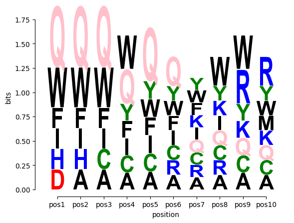

# weblogo_peptide
Generating peptide weblogo using pure Python. It is currently under development, supports for differnet color schema and different fonts will be supported in the future.


## Dependencies
1. matplotlib
2. scipy
3. seaborn
4. numpy


## Usage
```python
python pweblogo.py --peptide peptide.txt --out test.png
```

## Example
Input (peptide.txt):
```
FIWACYQRKW
QFIWACYQRK
DHQWQQFIWA
IWACYQRKWR
QQFIWACYQR
HQWQQFIWAC
WQQFIWACYQ
QWQQFIWACY
WACYQRKWRM
```

Output (test.png):



## Similar packages

1. [Logomarker](https://logomaker.readthedocs.io/en/latest/)
2. [pyseqlogo](https://github.com/saketkc/pyseqlogo)


## Reference

1. WebLogo: A Sequence Logo Generator (https://www.ncbi.nlm.nih.gov/pmc/articles/PMC419797/)

2. StackOverflow (https://stackoverflow.com/questions/42615527/sequence-logos-in-matplotlib-aligning-xticks)


